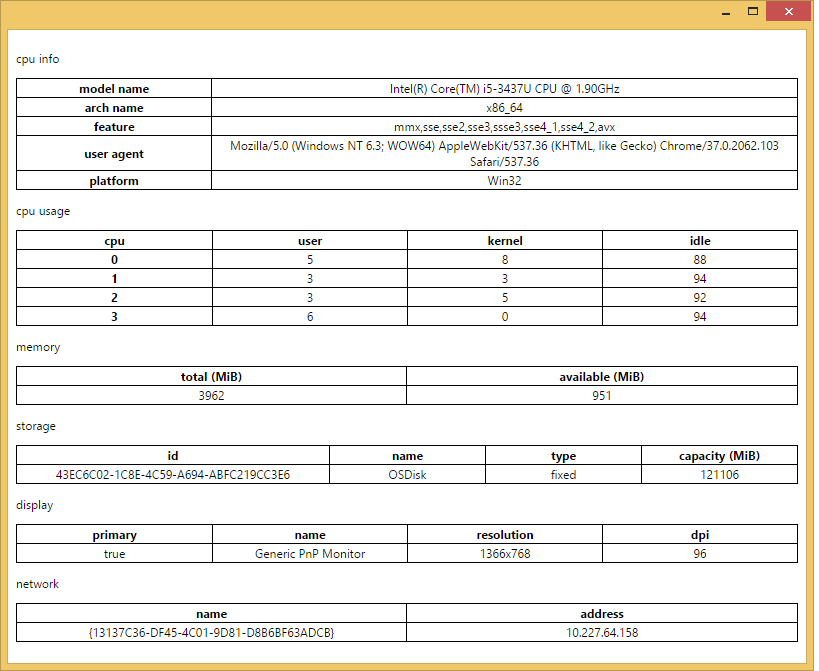
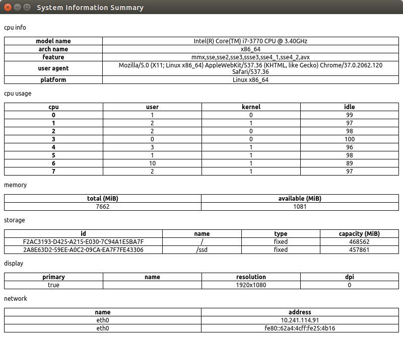
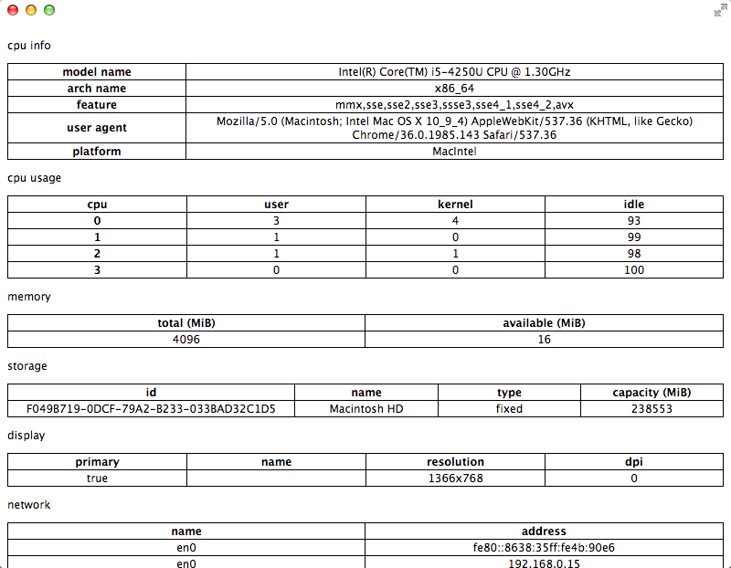
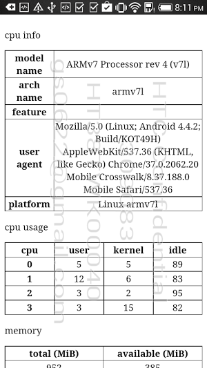
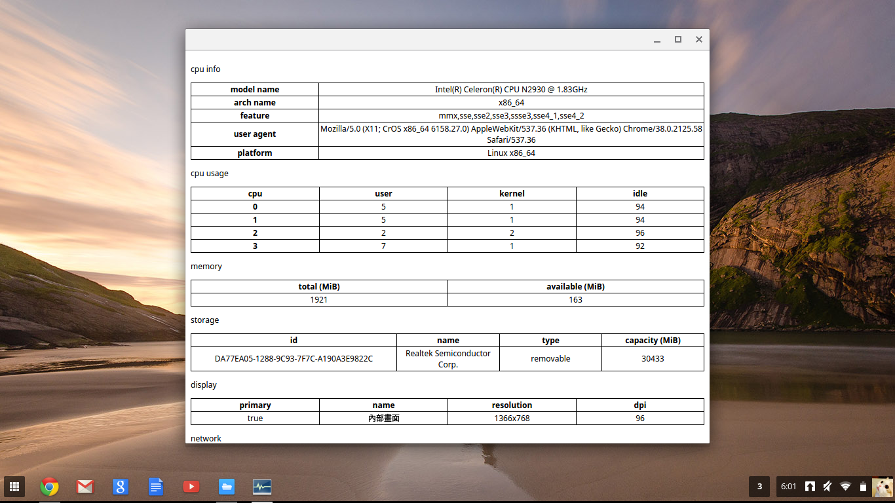

sysinfo
=======

System Information base on Chrome system javascript API

=======
#### Used API

| Name          | Description                   | Since |
|---------------|-------------------------------|:-----:|
| system.cpu    | [query CPU metadata](https://developer.chrome.com/apps/system.cpu)            | 32    |
| system.memory | [query memory info](https://developer.chrome.com/apps/system.memory)          | 32    |
| system.storage| [query storage device info](https://developer.chrome.com/apps/system.storage) | 30    |
| system.display| [query display metadata](https://developer.chrome.com/apps/system.display)    | 30    |
| system.network| [query network device info](https://developer.chrome.com/apps/system.network) | 33    |

=======
#### Snapshots

| Windows    | Ubuntu     | Mac        |
|:----------:|:----------:|:----------:|
|  |  |  |

| Android    | Chrome OS  |
|:----------:|:----------:|
|  |  |

=======
#### Howto
On Windows/Ubuntu/Mac, go to [chrome://extensions](chrome://extensions), press the button of 'Load unpacked extension...', the load this project folder.
On Android, use [Chrome Dev Editor](https://github.com/dart-lang/chromedeveditor) to open this project, then deploy to mobile.

-enjoy

